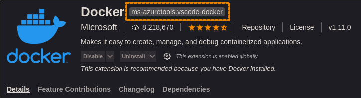

# Ansible Role: Visual Studio Code

[](https://github.com/skaary/ansible-role-vscode/actions?query=workflow%3Ci)

An Ansible Role that installs [Visual Studio Code](https://code.visualstudio.com/) and allows management (install/uninstall) of Visual Studio Code extensions on Linux.

## Installation

Download the role directly from git by typing into your terminal:

```bash
$ ansible-galaxy install git+https://github.com/skaary/ansible-role-vscode.git
```
or

```bash
$ ansible-galaxy install git+https://github.com/skaary/ansible-role-vscode.git,,vscode
```

to change the installed role name from _ansible-role-vscode_ to just _vscode_.

Alternatively, install the role via a _requirements.yml_ file, e.g. when installing multiple roles at once. See [ansible galaxy documentation](https://galaxy.ansible.com/docs/using/installing.html#installing-multiple-roles-from-a-file) for more information.

## Role Variables

| Variable name                 | Default value                                    | Description                                                                |
| ----------------------------- | ------------------------------------------------ | -------------------------------------------------------------------------- |
| `vscode_user`                 | `{{ ansible_user_id }}`                          | The name of the user to install Visual Studio Code for. **Required**.          |
| `vscode_download_url`         | `https://go.microsoft.com/fwlink/?LinkID=760868` | The URL from where Visual Studio code is downloaded from. **Required**.        |
| `vscode_deb_path`             | `/tmp/vsc.deb`                                   | The location where the Visual Studio code .deb is downloaded to. **Required**. |
| `vscode_extensions_install`   | `[]`                                             | The extension(s) to be installed.                                          |
| `vscode_extensions_uninstall` | `[]`                                             | The extension(s) to be uninstalled.                                        |

## How to find the extension ID of an extension

There are two ways to find the extension ID: on the extension details page or from the command line (only possible for already installed extensions).

### Extensions Details Page

Navigate to the extensions detail page of the extension you wish to install and look for the extension ID next to the extension name (highlighted in orange):



### Command line

To export a list of currently installed extensions use following command to store all extensions in a file called `code_extensions.txt`:

```bash
code --list-extensions > code_extensions.txt
```

The output of this command looks like:

```bash
alefragnani.project-manager
donjayamanne.githistory
```

Add the list of extensions to the variable `vscode_extensions_install` to install them with Ansible.

## Example Playbook

```yaml
- hosts: all
  vars:
    vscode_user: molecule
    vscode_extensions_install:
      - alefragnani.Bookmarks
      - alefragnani.project-manager
      - ban.spellright
  roles:
    - ansible-role-vscode
```

## Testing the role

### Vagrant

Vagrant can be used to test the role in order to graphically see it working in a virtual machine. Make sure Vagrant and VirtualBox are installed:

```bash
$ sudo apt install vagrant virtualbox
```

Use the following commands to run vagrant and boot up the virtual machine:

```bash
$ cd tests
$ vagrant up
```

Use `vagrant destroy` after you are done testing to delete the virtual machine. For more information about Vagrant and its commands, see the [Vagrant documentation](https://www.vagrantup.com/docs/cli).

### Molecule with Docker

Molecule can be used to test the role with a docker container. Make sure Molecule is installed:

```bash
$ python3 -m pip install --user "molecule[docker]"
```

Use the following commands to run Molecule in order to create the docker container and access the created container:
```bash
$ molecule converge && molecule login
```

For more information on how to use Molecule please consult the [Molecule documentation](https://molecule.readthedocs.io/en/latest/getting-started.html).

> Note: Python and Docker are required for the use of molecule. For more information, see [Molecule installation](https://molecule.readthedocs.io/en/latest/installation.html).

## License

MIT / BSD
